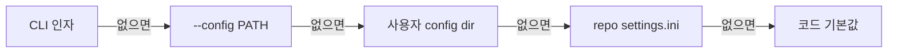
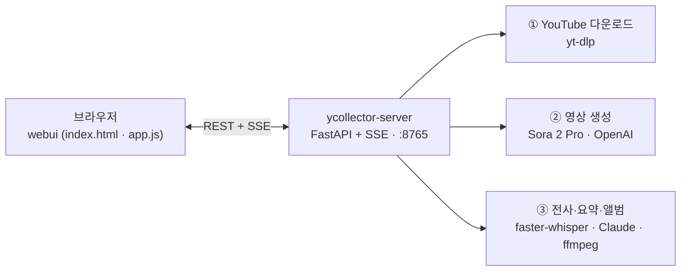
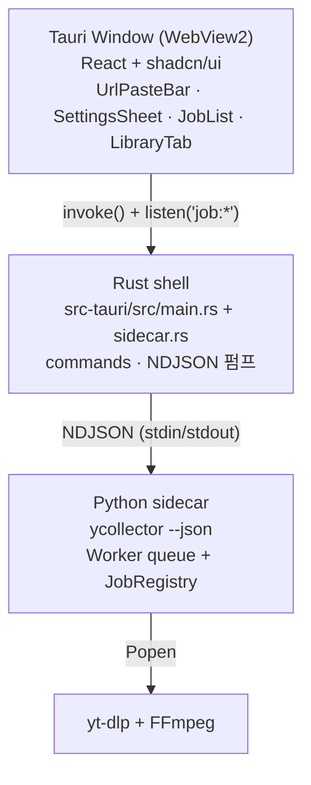

# YCollector

YouTube 영상을 손쉽게 받고, 더 나아가 **전사·요약·장면 앨범** 분석과 **Sora 2 Pro 영상 생성**까지 한곳에서 하는 데스크톱 도구.
코어는 **yt-dlp**, UI는 **로컬 웹 서버**(가장 가벼움) · **CLI** · **Tauri + React + shadcn/ui**(신규 네이티브 앱) · **PySide6**(legacy)로 골라 쓸 수 있습니다.

> **현재 동작**: CLI 다운로드 · 로컬 웹 서버 · Sora 영상 생성 · 전사/요약/앨범 분석.
> 네이티브 Tauri 데스크톱 앱은 기능 패리티 도달까지 진행 중([계획](docs/plan/youtube_downloader_frontend_plan_260516.md)).
> 설계 문서는 [`docs/`](docs/) 또는 [`docs/index.html`](docs/index.html), 시각 설치 가이드는 [`README.html`](README.html).

---

## 목차

- [빠른 시작](#빠른-시작) — 어떤 방법으로 쓸까
- [설정과 환경변수](#설정과-환경변수) — `.env` · `settings.ini`
- [로컬 웹 서버](#로컬-웹-서버) — 브라우저에서 바로 (Tauri 불필요)
- [전사 요약 앨범 분석](#전사-요약-앨범-분석)
- [CLI 다운로드](#cli-다운로드)
- [영상 생성 CLI](#영상-생성-cli)
- [데스크톱 앱 Tauri](#데스크톱-앱-tauri)
- [쿠키 로그인](#쿠키-로그인) — 비공개·멤버십·연령제한
- [트러블슈팅](#트러블슈팅)
- [단일 exe 빌드](#단일-exe-빌드)
- [프로젝트 구조](#프로젝트-구조)
- [문서](#문서)
- [로드맵](#로드맵)
- [개발](#개발)

---

## 빠른 시작

모든 실행은 **소스에서 바로** 돕니다. 빌드 없이 `uv` 만 있으면 됩니다.
공통 1회: [`uv`](https://github.com/astral-sh/uv) 설치(`winget install astral-sh.uv`) → 클론 → `uv sync`.

```powershell
git clone https://github.com/dalyulbam/YCollector.git
cd YCollector
uv sync            # .venv 자동 생성 + 의존성 설치
```

목적에 따라 한 줄만 고르면 됩니다:

```mermaid
flowchart TD
    Q{"무엇을 하고 싶나요?"}
    Q -->|"빠르게 다운로드만"| CLI["CLI · ycollector<br/>설치: uv 만"]
    Q -->|"브라우저에서 다운로드 + 영상생성 + 전사요약"| WEB["로컬 웹 서버 · ycollector-server<br/>설치: uv (+extra), Rust 불필요"]
    Q -->|"네이티브 데스크톱 앱"| TAURI["Tauri 앱 · cargo tauri dev<br/>설치: uv + Node + Rust"]
```



| 목적 | 방법 | 추가 설치 | 한 줄 실행 |
|---|---|---|---|
| **다운로드만 빠르게** | CLI | 없음 | `uv run ycollector <URL>` |
| **브라우저 UI**(다운로드 + 영상생성 + 전사·요약·앨범) | 로컬 웹 서버 | `--extra web` 등 | `uv run ycollector-server` |
| **네이티브 앱** | Tauri | Node + Rust | `cd src-tauri ; cargo tauri dev` |

> ⚠️ **백신·사내 프록시가 TLS 를 가로채는 환경**이라면, `uv` 가 휠을 절반만 받는 **부분 설치**로 `CERTIFICATE_VERIFY_FAILED` 또는 나중에 `module … has no attribute …` 가 날 수 있습니다. 설치 명령 **전에** 이 셸에서 `$env:UV_NATIVE_TLS = "1"` 를 한 번 실행하세요(영구 적용은 `setx UV_NATIVE_TLS 1` 후 새 터미널, 또는 명령마다 `--native-tls`). 복구는 [트러블슈팅](#트러블슈팅) 참고.

---

## 설정과 환경변수

### `.env` — API 키 (선택)

영상 생성·요약 기능을 쓸 때만 필요합니다. 저장소 루트에 `.env` 를 만들고 **필요한 키만** 넣으면 `video-gen` / `summarize` extra 가 자동 로드합니다(python-dotenv). **다운로드만 쓸 거면 `.env` 는 필요 없습니다.**

```ini
# 영상 생성 (Sora 2 Pro) — ycollector-generate, 웹 서버 ② 패널
OPENAI_API_KEY=sk-...

# 전사록 → 구조화 요약 (Claude) — ycollector-analyze, 웹 서버 ③ 패널
ANTHROPIC_API_KEY=sk-ant-...
```

| 키 | 쓰임 | 필요 시점 |
|---|---|---|
| `OPENAI_API_KEY` | Sora 2 Pro 영상 생성 | 영상 생성 기능 |
| `ANTHROPIC_API_KEY` | 전사록 요약 (전체요약·핵심파트·시간대) | 요약 기능 (전사만이면 불필요) |

> 🔒 키는 **절대 커밋하지 마세요**. `.env` 는 `.gitignore` 에 포함되어 있습니다.

### `settings.ini` — 다운로드 기본값

화질·코덱·자막·재생목록·네트워크 기본값은 [`settings.ini`](settings.ini) 한곳에서 조정합니다. 적용 우선순위(왼쪽이 먼저, 없으면 다음으로 폴백):



- **사용자 config dir**(개인 설정 — 저장소를 건드리지 않음):
  - Windows: `%APPDATA%\YCollector\settings.ini`
  - macOS: `~/Library/Application Support/YCollector/settings.ini`
  - Linux: `~/.config/ycollector/settings.ini`
- **섹션**: `[defaults]`(quality/codec/audio/container) · `[output]`(output_dir/자막/쿠키) · `[playlist]`(mode/max_downloads/items) · `[network]`(socket_timeout/retries/throttled_rate). 멈춤 대응(`throttled_rate = 100K` 등)도 여기서.
- 자세히는 [사용설명서 §8.5](docs/howToUse/user_manual_260513.md#85-설정-파일-settingsini).

### 서버 설정 (`ycollector-server`)

| 옵션 | 기본 | 설명 |
|---|---|---|
| `--host` | `127.0.0.1` | 바인드 주소 (LAN 공유 시 `0.0.0.0`) |
| `--port` | `8765` | 포트 (`--port 0` = 빈 포트 자동 선택) |
| `--no-browser` | (off) | 자동 브라우저 열기 끄기 |

다운로드 출력 폴더·화질 등은 위 `settings.ini` 를 그대로 따릅니다.

---

## 로컬 웹 서버

Tauri/Rust 없이 한 줄로 뜨는 로컬 웹 UI. **FastAPI + SSE 백엔드 + 단일 HTML** 한 페이지에서 다운로드 · Sora 영상 생성 · 전사/요약/앨범 분석을 모두 합니다.



### 가동

```powershell
# 한 번만 — 필요한 기능의 extra 만 설치 (TLS 가로채기 환경은 --native-tls 추가)
uv sync --extra web                                   # ① 다운로드만
#  + 영상 생성:    --extra video-gen     (.env 의 OPENAI_API_KEY)
#  + 전사:         --extra transcribe    (GPU 면 --extra transcribe-cuda 도)
#  + 요약:         --extra summarize     (.env 의 ANTHROPIC_API_KEY)
# 전부:
uv sync --extra web --extra video-gen --extra transcribe --extra summarize --native-tls

# 가동 (브라우저 자동 오픈)
uv run ycollector-server
# → http://127.0.0.1:8765/
```

> 💡 `module 'httptools' has no attribute 'HttpRequestParser'` 로 죽으면 `--extra web` 이 부분 설치된 것(TLS 가로채기 환경에서 흔함). `uv pip install --reinstall --no-cache --native-tls httptools` 로 복구. 예방은 위 `UV_NATIVE_TLS` 안내 참고.

### UI 구성

1. **YouTube 다운로드** — URL 붙여넣고 Enter. 진행률은 SSE로 실시간.
2. **영상 생성 (Sora 2 Pro)**
   - **① 참고 이미지/영상** — 로컬 파일 업로드(드래그드롭) 또는 URL. YouTube면 thumbnail, 영상 파일은 **첫 프레임**을 앵커로. 출력 size에 맞게 자동 리사이즈.
   - **② 프롬프트** — 입력 + `+` 로 여러 줄 누적 → 호출 시 한 문장으로 합쳐 전송.
   - 옵션: model(sora-2-pro / sora-2), size(가로 1280×720·1792×1024 / 세로 720×1280·1024×1792), seconds(4/8/12). **예상 비용** 실시간 표시 + 클릭 직전 confirm.
   - 프롬프트 1개 → 단일 영상. 2개 이상(또는 reference 2개 이상) → **연속형**: 각 장면을 last-frame chaining 으로 이어 1개 연속 영상.
3. **전사 · 요약 · 앨범 분석** — 아래 [전사 요약 앨범 분석](#전사-요약-앨범-분석) 참고.

상세 시각화는 [`README.html`](README.html) §7~§8.

---

## 전사 요약 앨범 분석

받아둔(또는 갖고 있는) 음성/영상을 **전사 → 구조화 요약 → 장면 앨범북**으로 분석합니다. `faster-whisper`(전사) + `Claude`(요약) + `ffmpeg`(장면 캡쳐) 조합. GPU 없으면 자동으로 CPU(int8) 폴백합니다.

```powershell
# 설치 — 전사 + 요약 (TLS 가로채기 환경은 --native-tls)
uv sync --extra transcribe --extra summarize --native-tls
#  GPU(CUDA 12) 추론:   --extra transcribe-cuda  추가
#  화자 분리(이름 없이 화자만 구분):  --extra diarize
```

산출물은 파일 폴더 아래 `_analysis/`(`<이름>.srt · .script.md · .summary.md`)와 `_album/`(`index.html` + 장면 캡쳐)에 저장됩니다.

### 웹 보드 (서버 ③ 패널)

`uv run ycollector-server` → ③ 패널이 다운로드 루트(`output_dir`, 그리고 `download/`·`downloads/`)를 스캔합니다. 파일을 골라 **분석 실행**(언어/요약 on·off/예산 옵션) → 끝나면 요약·대본을 앱 안에서 바로 열람 → **앨범 생성**까지. 진행률은 SSE.

### CLI

```powershell
# 전사 + 대본 + 요약(핵심 파트·시간대)
uv run ycollector-analyze "C:\video\talk.mp4" --language ko --budget-usd 5
uv run ycollector-analyze "C:\video\talk.mp4" --no-summarize     # 전사+대본만

# 전사만 (자막 포맷 선택: txt/srt/vtt/json)
uv run ycollector-transcribe "C:\video\talk.mp4" --format srt

# 장면 앨범북 (ffmpeg 필요)
uv run ycollector-album --analysis-dir "C:\video\_analysis" --video-dir "C:\video"

# 화자 분리 (--extra diarize)
uv run ycollector-diarize --analysis-dir "C:\video\_analysis"
```

---

## CLI 다운로드

가장 가벼운 진입점. 자동화·배치에 권장. `uv sync` 만으로 동작합니다(추가 extra 불필요).

```powershell
# 단일 URL (기본: 1080p mp4 + ko/en 자막)
uv run ycollector https://www.youtube.com/watch?v=dQw4w9WgXcQ

# 화질/코덱 프리셋
uv run ycollector URL --quality 2160p --codec av1 --container mkv

# 오디오만
uv run ycollector URL --quality audio --audio m4a --no-subs

# 파일에서 (한 줄에 하나, '#' 주석)  /  stdin 파이프
uv run ycollector --from urls.txt
Get-Content urls.txt | uv run ycollector -

# JSON sidecar 모드 (Tauri UI 가 spawn) — stdin/stdout NDJSON
uv run ycollector --json

# Legacy PySide6 GUI (신규 Tauri UI로 대체 예정)
uv sync --extra gui-legacy        # PySide6 는 base 에 없음 — 이 extra 필요
uv run ycollector-gui
```

플래그 일부:
- `--quality {144p,240p,360p,480p,720p,1080p,1440p,2160p,best,audio}`
- `--codec {auto,h264,vp9,av1}` · `--audio {best,m4a,opus}` · `--container {mp4,mkv,webm}`
- `-f / --format SPEC` — raw yt-dlp 포맷 셀렉터(프리셋 무시)
- `-o / --output-dir` — 출력 폴더(기본 `./downloads`)
- `--no-subs` · `--sub-langs ko,en,ja`
- `--yes-playlist` — `&list=` 가 붙은 URL에서 재생목록 전체 받기(기본은 단일 영상)
- `--cookies-from-browser chrome` — 비공개/연령제한/멤버십(브라우저는 닫혀 있어야 함, [쿠키 로그인](#쿠키-로그인) 참고)

> 기본값은 [`settings.ini`](settings.ini)에 모여 있습니다 — [설정과 환경변수](#설정과-환경변수) 참고.

---

## 영상 생성 CLI

자동화·배치·CI용 단축 진입점(`ycollector-generate`). `uv sync --extra video-gen` + `.env` 의 `OPENAI_API_KEY` 필요.

```powershell
uv run ycollector-generate "고양이가 비를 맞으며 우산을 들고 걷는 장면, 영화적 톤" `
  --references "C:\Users\user\Pictures\ref.jpg" `
  --references "https://www.youtube.com/watch?v=Y0913p-bfqY" `
  --model sora-2-pro --size 1280x720 --seconds 8 `
  --out generated/cat.mp4 --budget-usd 5
```

플래그:
- `--references REF` (반복) — 로컬 이미지 경로, 이미지 URL, 또는 YouTube URL(thumbnail 자동). N번 주면 N개 잡으로 분할(`cat-01.mp4`, `cat-02.mp4`, …).
- `--model {sora-2, sora-2-pro}` (기본 `sora-2-pro`)
- `--size {1280x720, 1792x1024, 720x1280, 1024x1792}` · `--seconds {4, 8, 12}` (단일 생성 최대 12초)
- `--budget-usd 5` — 잡 예상이 한도 초과면 실행 거부(가격 함정 방지)
- `--dry-run` — 견적·계획만 출력, API 호출 X

가격(추정 — 생성 전 확인창 표시): sora-2 720p ≈ **$0.10/s**, sora-2-pro 720p ≈ **$0.30/s**, 고해상 ≈ $0.50–0.70/s. 정확한 단가는 OpenAI 요금표 기준.

> ⚠ **OpenAI Videos API 는 2026-09-24 sunset 공지**. 본 통합은 `Provider` 추상화(`src/ycollector/generator/base.py`)로 만들어 후속 모델(Veo/Runway/Pika 등) 어댑터 추가가 1파일 변경입니다.

생성된 영상은 **라이브러리 manifest**에 `source: "generated"` 로 등록되어 Tauri UI / 로컬 서버 라이브러리 탭에서 다운로드 영상과 같이 검색됩니다.

---

## 데스크톱 앱 Tauri

URL 붙여넣기 → 버튼 한 번으로 다운로드. 설정은 우측 슬라이드 패널, 완료 항목은 라이브러리 탭에서 검색.

### 아키텍처



### 사전 요구사항

| 도구 | 버전 | 설치 |
|---|---|---|
| **Python** | 3.11+ (3.13 권장) | [python.org](https://www.python.org/) |
| **uv** | 최신 | `winget install astral-sh.uv` |
| **Node.js** | 18+ | [nodejs.org](https://nodejs.org/) |
| **pnpm** | 9+ (npm으로도 OK) | `npm i -g pnpm` |
| **Rust** | 1.77+ | `winget install Rustlang.Rustup` 후 `rustup default stable` |
| **tauri-cli** | ^2.0 | `cargo install tauri-cli --version "^2.0"` (`cargo tauri` 서브커맨드용) |
| **WebView2 Runtime** | 시스템 동봉 | Win11 기본 포함, Win10은 [Edge 페이지](https://developer.microsoft.com/microsoft-edge/webview2/)에서 |
| **FFmpeg** | 시스템 PATH | `winget install Gyan.FFmpeg` (DASH 머지에 필수) |

> Windows 외 OS는 현재 1차 타깃이 아닙니다. 동작은 하지만 인스톨러 빌드(`scripts/build_tauri.ps1`)는 PowerShell 전용.

### 개발 모드 (HMR)

dev 모드는 **터미널 1개**로 충분합니다. Tauri가 Vite를 자식으로 띄우고, Rust가 PATH의 `ycollector`를 sidecar로 spawn합니다.

```powershell
# 1회 준비
pnpm --dir frontend install               # pnpm 없으면: cd frontend ; npm install ; cd ..
cargo install tauri-cli --version "^2.0"  # cargo tauri 서브커맨드 (rustup엔 미포함)

# 이 셸에서 venv 활성화 → sidecar(ycollector)가 PATH에 노출됨
.\.venv\Scripts\Activate.ps1              # 또는 영구 등록: uv pip install -e .

cd src-tauri
cargo tauri dev
```

처음 가동은 Cargo 의존성 컴파일에 5~10분(정상), 이후엔 수 초.

**확인 포인트**: 창 우상단 `yt-dlp <버전>` 표시(=sidecar OK) · URL Enter 후 썸네일/제목 등장(=NDJSON 왕복 OK) · ⚙ 설정 변경이 `%APPDATA%\YCollector\settings.ini` 로 CLI와 공유.

### 프로덕션 빌드 (.msi / .exe 인스톨러)

```powershell
.\scripts\build_tauri.ps1
# 산출물: src-tauri/target/release/bundle/{msi,nsis}/
```

스크립트가 자동으로: **(1)** Nuitka로 `ycollector` CLI 빌드 → **(2)** `src-tauri/binaries/ycollector-x86_64-pc-windows-msvc.exe` 로 복사(Tauri sidecar 네이밍) → **(3)** `frontend/` 의존성 설치 + Vite 빌드(`pnpm install` + `pnpm build`, npm이면 `npm install` + `npm run build`) → **(4)** `cargo tauri build` → `.msi` + `.exe`.

옵션: `-SkipSidecar`(sidecar 이미 있으면 1~2단계 스킵) · `-Triple <triple>`(기본 `x86_64-pc-windows-msvc`, arm64 등 크로스 빌드).

---

## 쿠키 로그인

비공개·멤버십·연령제한 영상용. 메인 Chrome을 종료할 수 없거나 `Could not copy Chrome cookie database` 에러면 **가상 Chromium 한 번 로그인 → cookies.txt 영구 사용** 흐름을 권장합니다.

```powershell
# 한 번만
uv sync --extra cookies-headed
uv run playwright install chromium    # Chromium 다운로드 (~150MB, 1회)

# 별 Chromium 창이 뜸 → YouTube 로그인 → 자동 감지 후 닫힘 + 쿠키 저장
uv run ycollector-login               # → %APPDATA%\YCollector\cookies.txt

# 이후엔 그냥 받으면 됨 — ycollector 가 위 경로를 자동 탐지
uv run ycollector --yes-playlist "https://www.youtube.com/watch?v=...&list=PL..."
```

- 메인 Chrome은 켜둔 채로 OK(Playwright는 별 user-data-dir). 프로필은 `%APPDATA%\YCollector\pw-profile\` 에 영속 → 재로그인 불필요.
- `--cookies <FILE>` 로 명시 경로, settings.ini의 `cookies_file =` 로 영구. 자세히는 `src/ycollector/cookies.py` docstring.

---

## 트러블슈팅

| 증상 | 원인 / 해결 |
|---|---|
| `cargo: command not found` | Rust 미설치 → `winget install Rustlang.Rustup ; rustup default stable` 후 새 터미널 |
| `Could not copy Chrome cookie database` | Chrome 실행 중 락 → 위 [쿠키 로그인](#쿠키-로그인)의 `ycollector-login` 흐름 |
| `tauri: command not found` (cargo는 있음) | tauri-cli 미설치 → `cargo install tauri-cli --version "^2.0"` |
| `cargo tauri dev`에서 sidecar spawn 실패 | venv 미활성화 → 같은 터미널에서 `uv sync` 했는지 확인. 또는 `uv pip install -e .` 로 PATH 등록 |
| 창은 뜨지만 `yt-dlp <버전>` 표시 없음 | sidecar가 죽음 → DevTools(F12) Console의 `job:log` 확인, yt-dlp/FFmpeg 설치 여부 |
| 한글 제목이 깨짐 | Windows cp949 콘솔 문제 — cli/sidecar/server가 UTF-8 강제하므로 최신 커밋 사용 |
| `ANTHROPIC_API_KEY 가 없습니다` (요약 단계) | `.env` 에 키 추가 + `uv sync --extra summarize`. 키 없이 쓰려면 전사만(`--no-summarize`) |
| `ycollector-server` 가 `module 'httptools' has no attribute 'HttpRequestParser'` | `--extra web` 부분 설치(TLS 가로채기) → `uv pip install --reinstall --no-cache --native-tls httptools` |
| `pnpm install` 시 `error EPERM` | OneDrive 등 동기화 폴더 충돌 → node_modules 동기화 제외 또는 저장소를 동기화 밖으로 |
| Nuitka가 MinGW를 받겠다고 함 | 한 번 `Y` 수락. MSVC가 있으면 자동 선택 |
| 다운로드가 "준비 중…"에서 멈춤 | yt-dlp가 deno(JS 런타임) 대기 → `winget install DenoLand.Deno` 후 새 터미널 |
| 설치 후 임의 패키지의 `has no attribute` / `ImportError` | 휠이 잘린 **부분 설치**(주로 TLS 가로채기) → 해당 패키지: `uv pip install --reinstall --no-cache --native-tls <pkg>`. 광범위하면 `uv sync --reinstall --no-cache --native-tls` |
| `uv sync` 가 `CERTIFICATE_VERIFY_FAILED` / `unable to get local issuer certificate` | 백신·프록시 TLS 가로채기로 certifi가 CA를 모름 → `$env:UV_NATIVE_TLS="1"`(또는 `--native-tls`). Python HTTPS는 `truststore` 사용(이미 처리됨) |

---

## 단일 exe 빌드

`uv` 없이 더블클릭으로 실행하기.

```powershell
uv sync --extra build

# Nuitka 단일 .exe (권장 — 빠른 시작, AV 오탐 ↓)
uv run python scripts/build_exe.py
uv run python scripts/build_exe.py --mode pyinstaller   # 대안
uv run python scripts/build_exe.py --target both        # CLI .exe도 같이
```

결과: `dist/gui.dist/YCollector.exe`(Nuitka) 또는 `dist/YCollector/YCollector.exe`(PyInstaller). 바로가기를 만들어 시작 메뉴/바탕화면에 고정하면 됩니다.

---

## 프로젝트 구조

```
YCollector/
├── pyproject.toml             ← uv 프로젝트 + entry points + extras
├── settings.ini               ← 다운로드 기본값 (화질/자막/네트워크/재생목록)
├── .env                       ← API 키 (gitignored, 직접 생성)
├── README.md / README.html    ← 설치·실행 가이드 (.html = 시각본)
├── docs/                       ← 설계 문서 (.md + .html)
│   ├── index.html              ← 랜딩 (브라우저로 열기)
│   ├── plan/ · motif/ · howToUse/
│   └── _build_html.py          ← docs/*.md → *.html 빌드
├── src/ycollector/
│   ├── cli.py                  ← CLI 다운로드 진입 (`--json` 시 sidecar 라우팅)
│   ├── sidecar.py              ← NDJSON sidecar (Tauri UI 가 spawn)
│   ├── server.py               ← 로컬 웹 서버 (FastAPI+SSE)  ★ ycollector-server
│   ├── gui.py                  ← PySide6 메인 윈도우 (legacy)
│   ├── config.py · cookies.py  ← settings.ini 로더 / Playwright 로그인
│   ├── webui/                  ← 로컬 서버 UI (index.html · app.js · styles.css)
│   ├── engine/                 ← yt-dlp 래퍼 (ytdlp.py · format_spec.py)
│   ├── generator/              ← 영상 생성 (sora.py · base.py · media.py · cli.py)
│   └── transcribe/             ← 전사·요약·앨범 (whisper · summarize · album ·
│                                  analyze · diarize · report · cli · config)
├── frontend/                  ← Tauri 웹뷰용 React + Vite + Tailwind + shadcn/ui
└── src-tauri/                 ← Tauri 쉘 (Rust): main.rs · sidecar.rs · settings.rs · jobs.rs
```

추가 예정 모듈(작업 큐, SQLite 라이브러리, 채널 스케줄, 가이디드 워크플로우 등)은 plan §12 참고.

---

## 문서

`.html` 문서는 **브라우저로 열기만** 하면 됩니다(빌드 불필요).

```powershell
start README.html         # 설치·실행 시각 가이드 (스택/빌드 파이프라인/번들 비교 SVG)
start docs\index.html     # 설계 문서 랜딩

# docs/*.md 를 고쳤다면 .html 재생성
uv run python docs/_build_html.py
```

- **설계 계획 (plan v1.2)** — [`docs/plan/youtube_downloader_plan_260508.md`](docs/plan/youtube_downloader_plan_260508.md): 17개 섹션 + 부록 3개. 핵심 도전과제, YouTube 변경 적응 전략, 차별화 D1~D6.
- **경쟁 / 모티프 조사 (motif r1)** — [`docs/motif/youtube_downloader_motif_260508.md`](docs/motif/youtube_downloader_motif_260508.md): 20+개 프로젝트 분석(Parabolic, Stacher, Cobalt, NewPipe 등).

---

## 로드맵

| Phase | 산출물 | 상태 |
|---|---|---|
| 0 | CLI + 최소 GUI, 단일 URL | **완료** |
| 1 | 큐, 포맷 픽커, SQLite 영속화, 자가 갱신 v1 | 예정 |
| 2 | 라이브러리 (D1), 프리셋 (D2), 가이디드 PoToken (D3) | 예정 |
| 3 | 라이브, Whisper 전사 (D6), 클립보드 감시 (D4), 채널 스케줄 (D5) | 일부 진행 |
| 4 | i18n (ko/en/ja), 자동 업데이트, 코드 사이닝 | 예정 |
| 5 | 정식 배포 | 예정 |

> 참고: **전사·요약·앨범(D6)**, **Sora 영상 생성**, **로컬 웹 서버**는 로드맵보다 앞당겨 이미 동작합니다. 자세한 일정은 plan §8.

---

## 개발

```powershell
uv run ruff check src/      # 린트
uv run ruff format src/     # 포맷
uv run pytest               # 테스트 (현재는 없음)
```

---

## 라이선스

미정 (TBD — plan §13 OQ-8 참고). v1.0 정식 배포 전 결정.

## 면책

본 도구는 **자기 콘텐츠, 공개도메인, CC 라이선스, 또는 명시적 권한이 있는 콘텐츠** 다운로드를 위한 것입니다. 저작권 침해는 사용자 책임입니다 (plan §6.10 참고).
